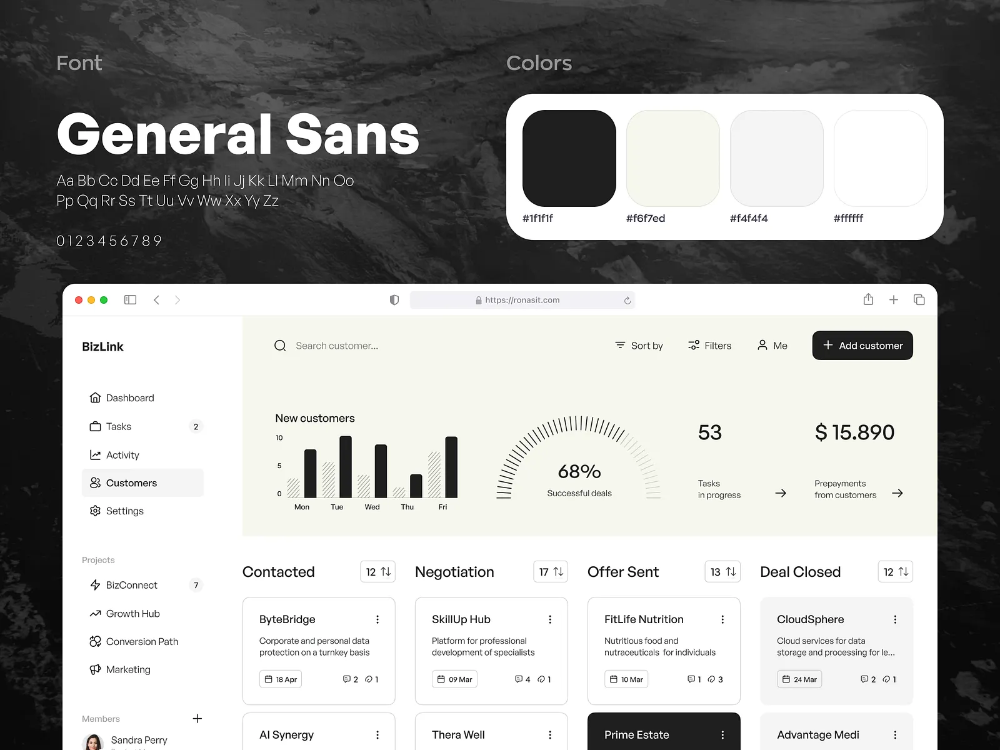
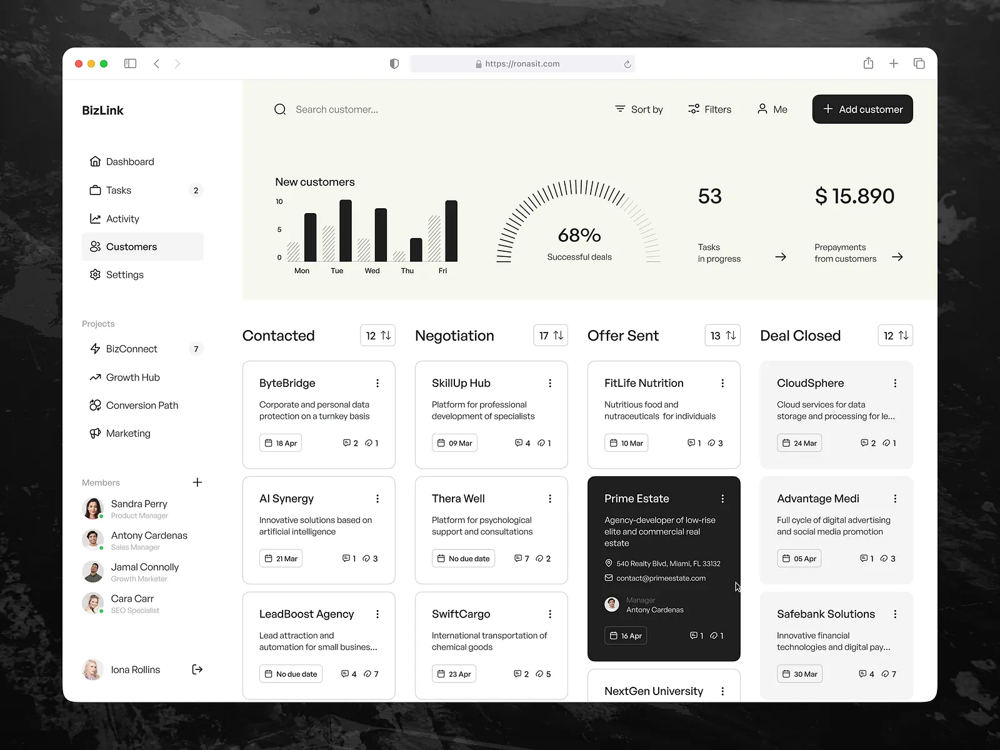
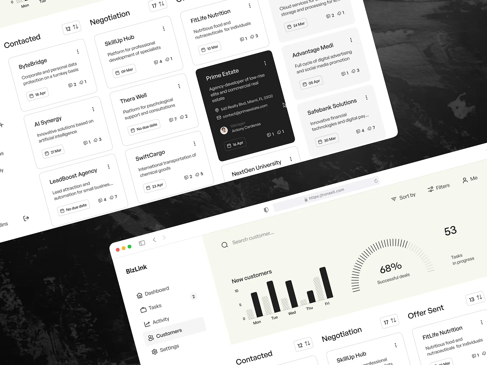

# CA Articleship — Mailer & Tracker 🚀

A premium, privacy-focused bulk mailer and application tracker designed specifically for CA & CMA students to streamline their articleship and industrial training applications.

---

## ✨ Overview

Applying for articleship can be a tedious process. This tool helps you send hundreds of personalized emails directly from your own Gmail account while keeping track of every single application in one cohesive, "Obsidian Purple" themed dashboard.

### 🛡️ Privacy First
Unlike other platforms, **your data stays with you**. 
- **No Servers:** The application runs entirely in your browser.
- **No Data Collection:** Your emails, contacts, and CVs are never stored on any external database.
- **Direct Integration:** Connects directly to Google's official API.

---

## 🚀 Key Features

- **📬 Bulk Gmail Sender:** Send personalized applications using `{name}` and `{firm}` placeholders.
- **📎 Smart Attachments:** Effortlessly attach your CV/Resume (up to 5MB).
- **📊 Application Tracker:** Auto-logs every sent email. Track status (Pending, Replied, Interview, etc.) and set follow-up dates.
- **🌙 Obsidian Purple UI:** A sleek, dark-themed interface built for a premium user experience.
- **📈 Exportable Data:** Keep your tracker data local or export it to CSV.

---

## 🛠️ Tech Stack

- **Frontend:** HTML5, Vanilla CSS3 (Custom Design System)
- **Logic:** Vanilla JavaScript (ES6+)
- **Integration:** Google OAuth 2.0 & Gmail API
- **Fonts:** Montserrat (Google Fonts)

---

## 📸 Screenshots

| Landing Page | Mailer Dashboard |
| :---: | :---: |
|  |  |

| Application Tracker |
| :---: |
|  |

---

## 🚦 Getting Started

1. **Open the Application:** Visit the [Live Demo](https://sharmaakshit421-sys.github.io/ca-mailer-new/).
2. **Connect Gmail:** Sign in with your Google account.
3. **Compose Email:** Draft your application using placeholders.
4. **Import Recipients:** Add recipient details in the table or paste them directly.
5. **Send & Track:** Hit send and monitor your progress in the Tracker tab!

---

## 📄 License

Built with ❤️ for the CA/CMA community. This project is for educational and personal use.

---

**[Visit CA Articleship Mailer](https://sharmaakshit421-sys.github.io/ca-mailer-new/)**
